# Computational Drug Discovery of Acetylcholinesterase Inhibitors

## Repository Structure
This repository contains the necessary scripts, data, and visualizations to perform computational drug discovery targeting human acetylcholinesterase:
* **`Data/`**: Contains the raw and processed datasets collected from the ChEMBL database.
* **`Figures/`**: Contains data visualizations and model performance plots generated during the analysis.
* **`1_BioactivityDataCollection.ipynb`**: Script for querying the ChEMBL API and retrieving baseline bioactivity data.
* **`2_ExploratoryDataAnalysis.ipynb`**: Script for filtering data, converting metrics (IC50 to pIC50), and conducting initial statistical analyses.
* **`3_DescriptorCalculation.ipynb`**: Script for calculating Lipinski drug-likeness descriptors and molecular fingerprints (PubChem).
* **`4_ModelBuilding.ipynb`**: Script for training, evaluating, and exporting various regression models to predict biological activity.

## How to Use
1. **Clone the repository** to your local machine.
2. **Install the required dependencies** using your preferred package manager (e.g., `pip install pandas numpy seaborn scikit-learn xgboost rdkit padelpy`).
3. **Execute the Jupyter Notebooks** in sequential order (1 through 4) to reproduce the data collection, exploratory data analysis, feature engineering, and model training processes.

---

## Introduction
Acetylcholinesterase (AChE) is an enzyme that regulates neurotransmission by breaking down acetylcholine, a major neurotransmitter involved in nerve signaling between neurons and muscle cells. Acetylcholinesterase inhibitors are widely studied for their potential to enhance cognitive function by preventing the rapid degradation of acetylcholine in the brain. Inhibiting AChE can help maintain higher levels of acetylcholine, which is beneficial for treating neurodegenerative diseases such as Alzheimer's disease.

Computational drug discovery methods have revolutionized the early stages of drug development by significantly reducing the time and cost required to identify potential drug candidates. Traditional drug discovery can take over a decade and cost billions of dollars, whereas computational approaches enable rapid virtual screening of extensive chemical libraries, prioritizing compounds with high predicted bioactivity. This targeted approach allows researchers to focus experimental efforts on the most promising candidates while avoiding costly and time-consuming testing of ineffective compounds.

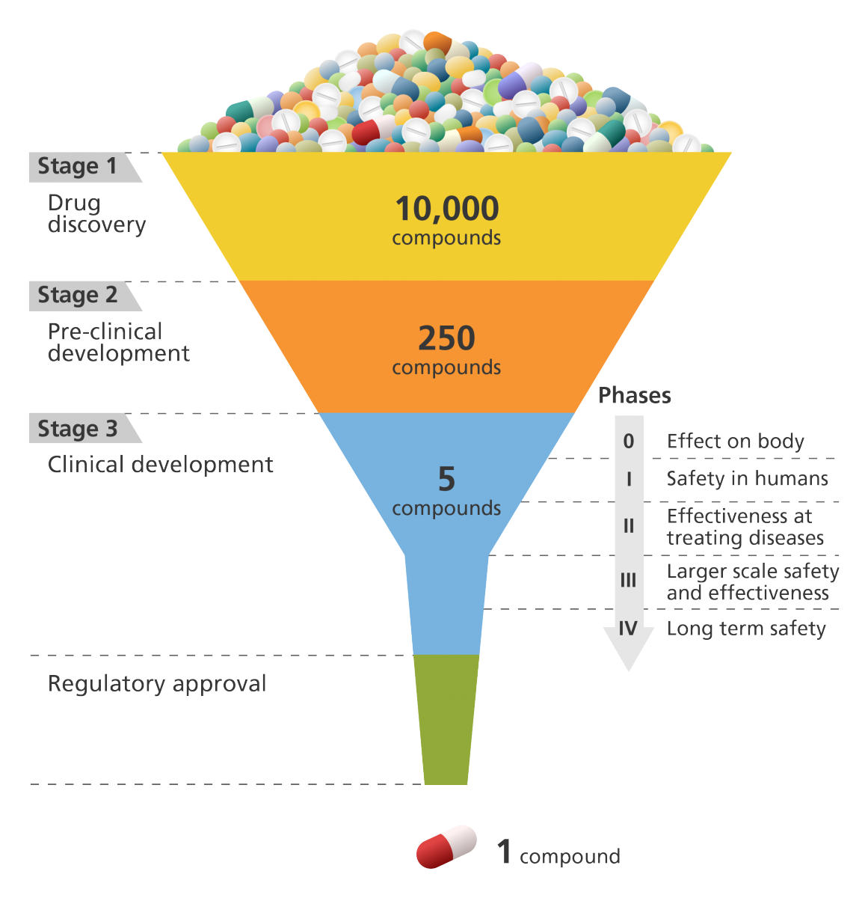

*The stages of drug development, demonstrating how initial drug discovery narrows down thousands of compounds to a single regulatory-approved treatment.*

## Purpose
The purpose of this study was to identify potential acetylcholinesterase inhibitors using computational methods. Thousands of chemical compounds were collected and analyzed to assess their potential as orally available drugs. Additionally, molecular features of the compounds were used to train a machine learning model capable of predicting the inhibitory activity of new molecules, facilitating more efficient identification of promising drug candidates.

The primary data source used was the ChEMBL database, a comprehensive repository of bioactivity data. As of February 27, 2025 (ChEMBL version 35), it contains curated information on over 2.5 million compounds, compiled from more than 92,100 research publications and 1.7 million assays.

## Process

### 1. Data Retrieval
To access relevant bioactivity data, the ChEMBL web service package was installed, and necessary Python libraries were imported:
* **Data handling and visualization:** pandas, seaborn, numpy, scipy
* **Chemical informatics:** rdkit, padelpy
* **Machine learning:** sklearn, lazypredict, xgboost

A search was performed for the target protein, human acetylcholinesterase (AChE), using the keyword "acetylcholinesterase". The ChEMBL database entry for human AChE is CHEMBL220, which was assigned to a variable for future reference.

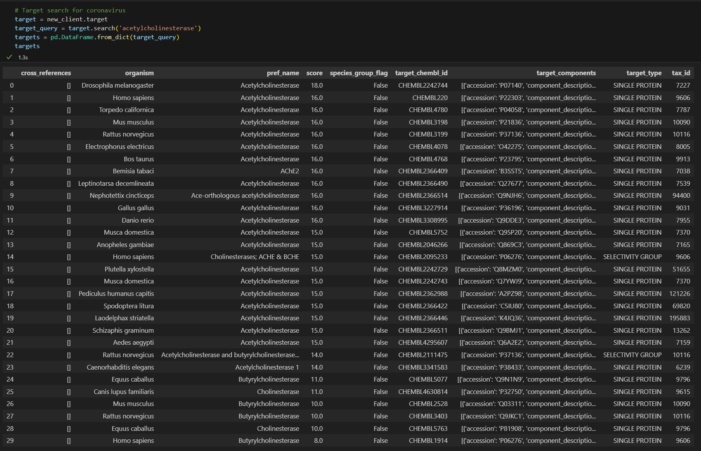

*Search results from the keyword "acetylcholinesterase". The target protein for this study was acetylcholinesterase in humans (the second entry).*

Using the ChEMBL API, bioactivity data for over 9,000 molecules was retrieved, specifically their IC50 values, which measure the concentration required to inhibit 50% of AChE activity. Lower IC50 values indicate stronger inhibitors. The retrieved data was stored in a pandas DataFrame.

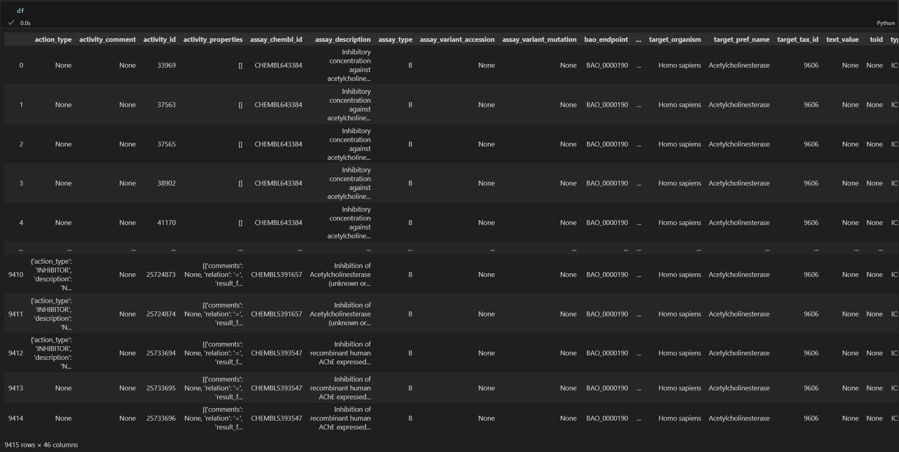

*Part of the pandas data frame containing the IC50 data for the target protein. Each row is a different molecule (9415 total) that inhibits the target protein. The value column represents the molecule's IC50 value.*

### 2. Data Preprocessing
* **Handling missing values:** Molecules with incomplete bioactivity data were removed, leaving 6,641 molecules.

**Bioactivity Classification**
Molecules were categorized based on their IC50 values:
* **Active:** IC50 ≤ 1,000 nM
* **Inactive:** IC50 ≥ 10,000 nM
* **Intermediate:** IC50 between 1,000 and 10,000 nM

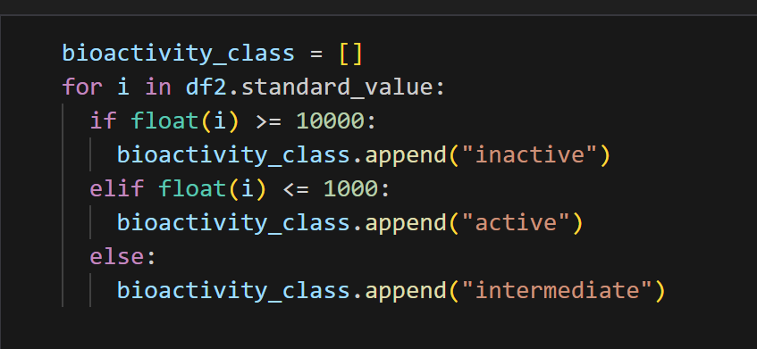

*The sorting of molecules into the appropriate activity classes. A new data column called 'bioactivity_class' was created. Then, each molecule was iterated through, appending the appropriate label to the new column based on the IC50 value.*

Each molecule's ChEMBL ID, canonical SMILES, IC50 value, and bioactivity class was stored in a new dataset. Cannonical SMILES (Simplified Molecular Input Line Entry System) are a unique string that represents a molecule's chemical structure in a linear text format.

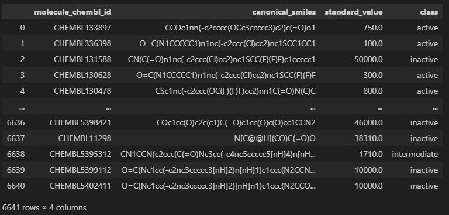

*The final dataset composed of 6641 molecules that inhibit AChE. For each molecule, its unique ChEMBL ID, canonical SMILES, IC50 value, and bioactivity class was present.*

### 3. Drug-Likeness Evaluation (Lipinski's Rule of Five)
Christopher Lipinski, a medicinal chemist at Pfizer, developed the Lipinski descriptors to assess whether a compound is likely to be an orally bioavailable drug. These descriptors evaluate a molecule's ADME properties (absorption, distribution, metabolism, excretion), which determine its effectiveness as a drug.

He presented the Rule of Five, a guideline with numbers all multiples of 5 that predicts whether a compound is likely to be well-absorbed in the human body. The rule states that a molecule is more likely to be an orally active drug if it meets these criteria:
* Molecular weight (MW) < 500 Daltons
* LogP (lipophilicity) < 5
* ≤ 5 hydrogen bond donors
* ≤ 10 hydrogen bond acceptors

These guidelines suggest that the drug will be able to cross cell membranes while also being soluble in the gut. A molecule that violates these rules is less likely to be orally bioavailable. For this study, Lipinski descriptors were calculated for each molecule in the dataset so that they could be later used to filter out poor candidates.

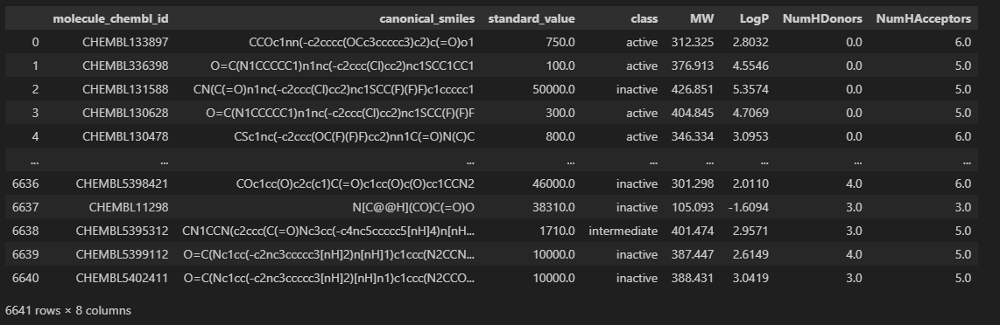

*The DataFrame with Lipinski Descriptors added.*

### 4. IC50 to pIC50 Conversion
The IC50 (half-maximal inhibitory concentration) values of molecules were converted into pIC50 values using the transformation:

pIC50 = -log10(IC50 in M)

This conversion logarithmically scales the data. The wide-ranging values were transformed into a normal distribution, which is beneficial for statistical analysis and training of machine learning models. 
* **Interpretation:** Higher pIC50 values indicate more potent inhibitors, while lower pIC50 values indicate weaker inhibitors. 

To prevent negative pIC50 values, IC50 values were capped at 1 x 10^9 nM (1 M) before conversion. This does not affect the practical interpretation of the data because molecules with IC50 values above 1 M are so weak that their precise IC50 value does not matter. This ensures that the machine learning model would not get influenced by meaningless negative pIC50 values.

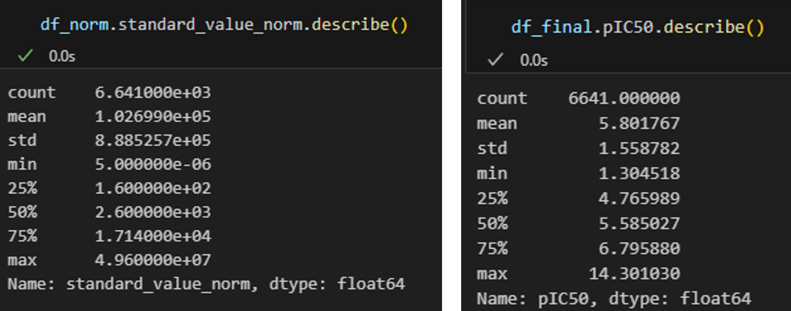

*The effect of the pIC50 conversion on the dataset, scaling the wide-ranging baseline data into a normalized distribution.*

### 5. Removal of the Intermediate Class
After converting IC50 values to pIC50, the dataset was further refined by removing molecules classified as "intermediate". This was done to create a binary sorting problem for the machine learning model. Getting rid of the inherently ambiguous class without a clear biological interpretation cleans the data to reveal molecules as either active or inactive, better allowing the machine learning model to learn what the difference between them is.

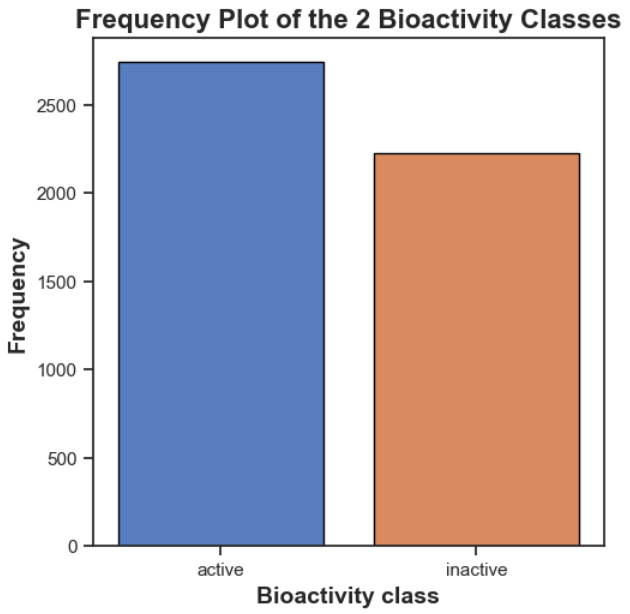

*Frequency Plot of the 2 Bioactivity Classes.*

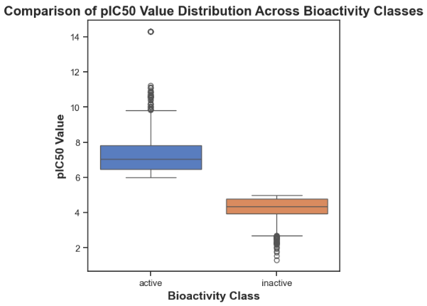

*Box plots of the pIC50 values for the two classes, visually demonstrating the active and inactive ranges.*

### 6. Screening and Selection of Drug-Like Acetylcholinesterase Inhibitors

**Statistical Analysis of Lipinski Descriptors (Mann-Whitney U Test)**
To determine whether the Lipinski descriptors (molecular weight, LogP, hydrogen bond donors, and hydrogen bond acceptors) differed significantly between active and inactive molecules, a Mann-Whitney U test was performed. The results showed that the p values, the probability that the results are due to random change, was much lower than the alpha value of 0.05. Therefore, all four Lipinski descriptors differed significantly between active and inactive molecules, confirming that these features are relevant for predicting bioactivity.

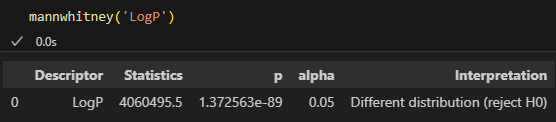

*Mann-Whitney U test results indicating LogP differs significantly between active and inactive compounds.*

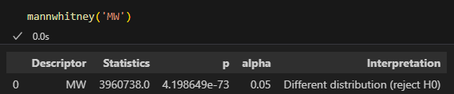

*Molecular weigh had a p value of 4.20 x 10^-73.*

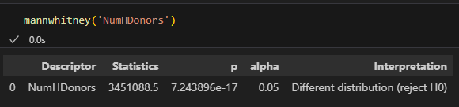

*The number of hydrogen bond donors had a p value of 7.24 x 10^-17.*

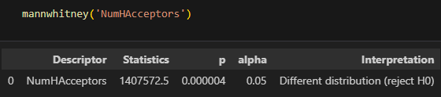

*The number of hydrogen bond acceptors had a p value of 4.00 x 10^-6.*

**Screening for the Best Drug-Like Inhibitors**
A scatter plot was created to visualize the molecular weight versus lipophilicity of the molecules. These 2 descriptors have a stronger effect on absorption and bioavailability compared to the numbers of hydrogen bond acceptors and donors. Their higher restrictiveness makes them a good filter for screening the molecules. The area shaded in red, labelled 'Lipinski's Region', defines the area where molecular weight is less than 500 daltons and logP is less than 5. Thus, active molecules in this region were identified as strong candidates for further study, based on both potency and drug-likeness.

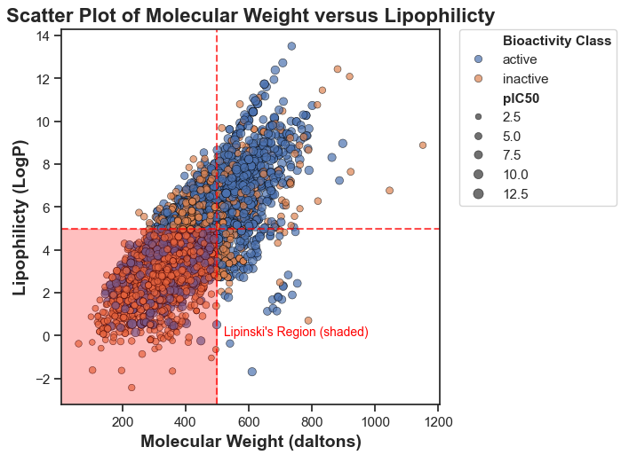

*Active molecules in the shaded region in the plot represent the best drug-like inhibitors from the dataset.*

### 7. Molecular Fingerprint Generation and Feature Selection
After identifying the most promising drug-like inhibitors, the next step was to generate molecular fingerprints and select the most relevant features for training a machine learning model to predict the bioactibity of new molecules. Unlike the Lipinski descriptors, which evaluate overall drug-likeness, fingerprints provide a detailed structural representation of each molecule. 

The fingerprint descriptors encode structural features at the atomic level, describing the presence or absence of specific substructures in a molecule. Molecular fingerprints allow machine learning models to learn patterns from the chemical structure itself, making them the primary input features for model training.

**Fingerprint Descriptor Calculation and Feature Selection**
The PubChem fingerprint method was used to generate molecular fingerprints. The PADEL-Descriptor software was accessed via the `padelpy` Python wrapper to compute these descriptors for each molecule. Each molecule was converted into a binary vector of 881 features, representing its unique chemical structure.

Not all 881 fingerprint features were informative for predicting bioactivity. To optimize model performance, low-variance features (variance < 0.16) were removed using `sklearn`, reducing the total number of descriptors from 881 to 146. This was done to ensure that the model is trained only on informative and relevant structural patterns, improving accuracy and efficiency.

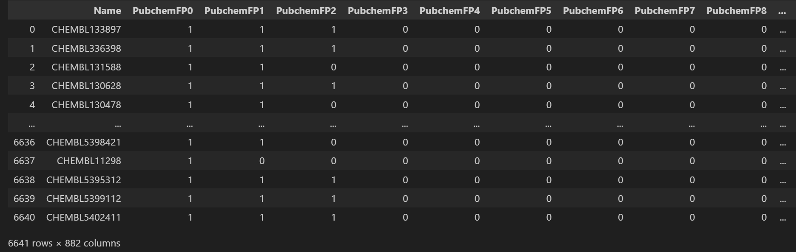

*A view into how the PubChem fingerprint looks.*

### 8. Machine Learning Model Training
Data was separated into features (fingerprint descriptors) and output (pIC50). The dataset was then split 80/20 into training and test sets. Finally, 42 reressor models were trained and evaluated. After performance comparison, the XGBRegressor was chosen as the final model due to its superior performance and speed.

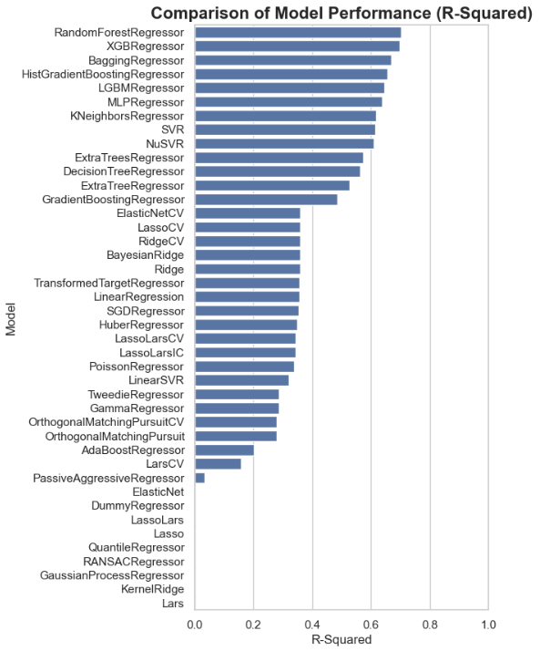

*Comparison of model performance based on R-Squared metrics.*

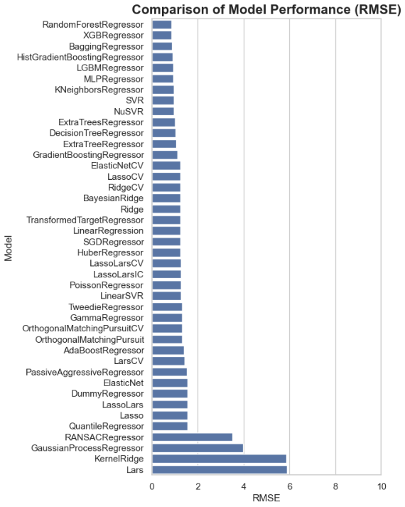

*Comparison of model performance based on RMSE values.*

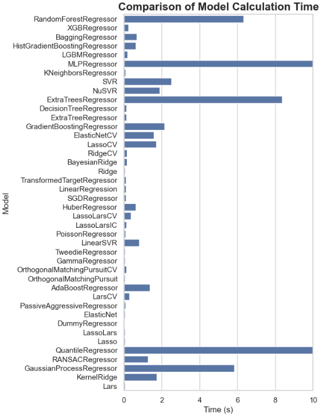

*Comparison of model calculation time.*

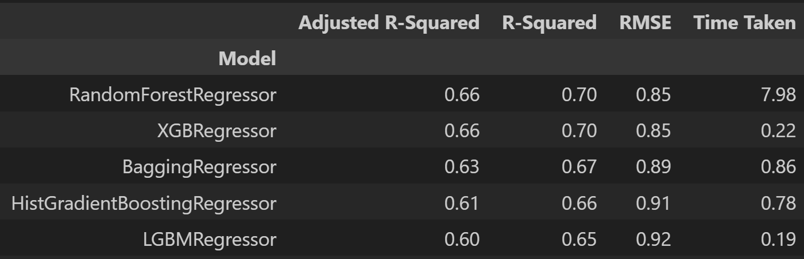

*The scores of the top 5 models. The top 2 have the same R-Squared values, but XGBRegressor is much faster.*

### 9. Model Export
The trained XGBRegressor model was saved as a pickle file for future use, enabling rapid prediction of bioactivity for new compounds. 

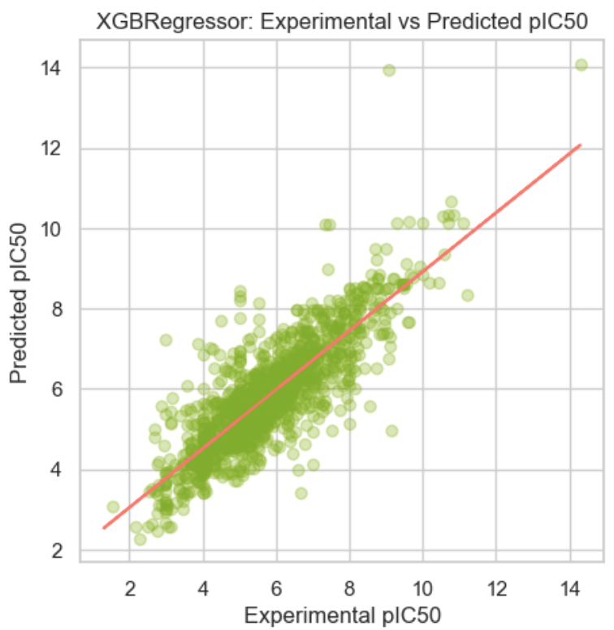

*Visualizes how well the model's predictions align with true experimental results.*

## Conclusion
This study demonstrates the power of bioinformatics and computational drug discovery in accelerating the identification of potential acetylcholinesterase inhibitors. By leveraging large-scale bioactivity databases like ChEMBL, cheminformatics techniques, and machine learning models, 6641 molecules were able to be rapidly screened, reducing the time and cost associated with traditional drug discovery.

This highlights how bioinformatics is transforming drug discovery by combining biological data, cheminformatics, and artificial intelligence. As computational tools continue to evolve, the ability to design and optimize drugs with high precision will become even more efficient, accelerating the development of new treatments for diseases.

By applying these techniques, researchers can navigate the vast chemical space more effectively, making the discovery of novel therapeutics faster and more cost-effective. This work reinforces the growing role of bioinformatics in modern pharmacology, proving that computational techniques are not just complementary to experimental research but are increasingly becoming the backbone of early-stage drug development.

*Code adapted from https://github.com/dataprofessor.*